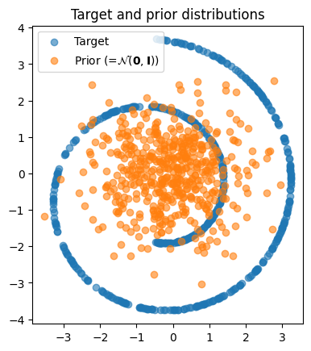
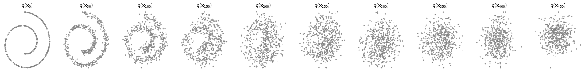
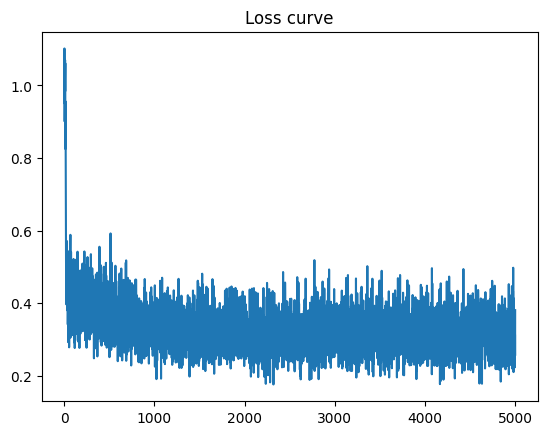
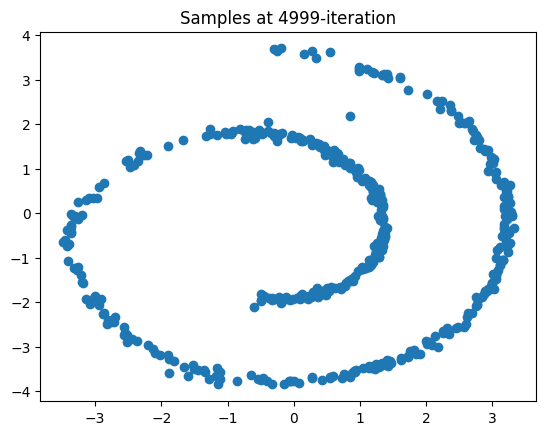
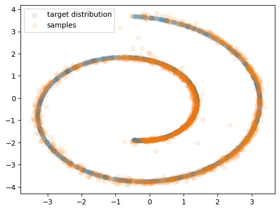

# Lab 1 — Denoising Diffusion Probabilistic Models (DDPM)

**課程**：NYCU Image and Video Generation (2026 Fall) — Programming Assignment 1
**學號 / 姓名**：`{{填入}}`
**繳交日期**：`{{填入}}`

---

> ### ⚠️ 這是草稿，交出去前請先處理
>
> 1. **Task 2 的所有章節目前是空的**，等訓練跑完再填。
> 2. 標成 `{{填入}}` 的地方都要補。
> 3. 下面每個數字我都標了出處，請自己再對一次 notebook 的輸出。
> 4. 這份是 Markdown，最後要轉成 `report.pdf`（VS Code 的 Markdown PDF 外掛、Pandoc、
>    或貼到 Word 都可以）。
> 5. 圖片路徑是相對於 `report/`，轉 PDF 前確認圖有正確嵌入。

---

## 目錄

- [Task 1 — Swiss Roll (2D)](#task-1--swiss-roll-2d)
  - [1.1 實驗設定](#11-實驗設定)
  - [1.2 實作說明](#12-實作說明20-pts)
  - [1.3 前向過程視覺化](#13-前向過程視覺化10-pts)
  - [1.4 訓練結果與評估](#14-訓練結果與評估10-pts)
  - [1.5 實作過程遇到的問題](#15-實作過程遇到的問題)
- [Task 2 — Image Generation (AFHQ)](#task-2--image-generation-afhq)

---

# Task 1 — Swiss Roll (2D)

這個部分的目標是在一個二維的玩具資料集（Swiss Roll）上，從頭實作一個完整的 DDPM，
包含前向加噪、反向去噪、以及訓練用的損失函數。因為資料只有兩維，可以直接把整個分布畫出來，
所以很適合用來確認公式有沒有寫對。

## 1.1 實驗設定

| 項目 | 設定值 |
|---|---|
| 資料集 | Swiss Roll（`sklearn.datasets.make_swiss_roll` 取前兩維並正規化） |
| Diffusion 步數 T | 1000 |
| Beta schedule | linear，β₁ = 1×10⁻⁴ → β_T = 0.02 |
| 網路架構 | `SimpleNet`：4 層 `TimeLinear`，隱藏維度 [128, 128, 128] |
| 參數量 | 182,410 |
| Optimizer | Adam，lr = 1×10⁻³ |
| Batch size | 128 |
| 訓練步數 | 5,000 |
| 硬體 | NVIDIA RTX 4050 Laptop GPU |
| 訓練耗時 | 54 秒（約 92 it/s） |

> 除了 `device` 之外，所有超參數都維持 notebook 提供的預設值，沒有另外調整。

**圖 0：目標分布與先驗分布**



藍色是我們要學的目標分布（Swiss Roll，兩圈螺旋），橘色是標準高斯先驗 N(0, I)。
DDPM 要做的事情，就是學會如何把橘色那團東西變回藍色的形狀。

---

## 1.2 實作說明（20 pts）

### TODO #1 — `SimpleNet`（`network.py`）

**這個網路在做什麼**：吃一筆加了噪聲的資料 `x` 和它對應的時間步 `t`，輸出「我猜剛才加進去的噪聲長什麼樣」。輸入輸出都是 2 維。

**怎麼實作的**：助教提供的 `TimeLinear` 已經把「線性層 + 時間資訊」包成一個積木了 ——
它內部先做一次 `nn.Linear`，再把時間步經過 sinusoidal embedding + MLP 得到的向量拿來
**逐通道相乘**，藉此把時間條件注入特徵。所以我只需要決定要疊幾層、每層多寬。

作法是先把維度串成一條鏈：

```
[dim_in] + dim_hids + [dim_out]  =  [2, 128, 128, 128, 2]
```

相鄰兩個數字就是一層的 (in, out)，因此總共 4 層 `TimeLinear`。用迴圈把它們建出來之後，
存進 `nn.ModuleList`。

**為什麼一定要用 `nn.ModuleList` 而不是 Python 的 list**：
`nn.Module` 是靠「屬性指派」來追蹤子模組的。如果把層放在普通 list 裡，PyTorch 看不到它們，
`ddpm.parameters()` 會回傳空的，optimizer 就沒有任何參數可以更新 —— 程式照跑、不報錯，
但 loss 永遠不會下降。這是很容易踩到的無聲錯誤。

**forward 的兩個設計決定**：

1. 每一層都要把 `t` 一起傳進去（`layer(x, t)`），因為時間條件是在每一層各自注入的。
2. **最後一層之後不接啟動函數**。網路的輸出是要預測的噪聲 ε ~ N(0, I)，約有一半的值是負的；
   若在輸出端接 ReLU，這些負值會全部被壓成 0，模型永遠學不到完整的噪聲分布。
   中間層則使用 ReLU 提供非線性。

### TODO #2 — `q_sample`（前向過程）

**在做什麼**：把乾淨資料 x₀ 一次跳到任意時間步的加噪版本 x_t。

DDPM 的前向過程理論上是一步一步加噪 T 次，但因為每一步都是高斯，整條鏈有封閉解，
可以直接一步到位（論文 Eq. 4）：

```
x_t = √(ᾱ_t) · x₀ + √(1 − ᾱ_t) · ε ,     ε ~ N(0, I)
```

其中 ᾱ_t = Π α_i 是 alpha 的累積乘積。實作上就是這一行：

```python
xt = alphas_prod_t.sqrt() * x0 + (1 - alphas_prod_t).sqrt() * noise
```

**兩個實作細節**：

- 係數要用 `alphas_cumprod`（ᾱ_t）而不是 `alphas`（α_t）。前者是累積量，後者只是單步的。
- helper function `extract()` 會依照 batch 裡每個樣本各自的 `t` 去取對應的 ᾱ 值，
  並 reshape 成 `(B, 1)`，這樣才能跟 `(B, 2)` 的資料做 broadcasting。

**為什麼這個封閉解很重要**：正因為可以一步跳到任意 t，訓練時才能隨機抽一個 t 就直接算 loss，
不必真的模擬 1000 步。這是 DDPM 能被有效訓練的關鍵。

### TODO #3 — `p_sample`（反向過程，單步）

**在做什麼**：從 x_t 往回退一步到 x_{t−1}。

反向過程 q(x_{t−1} | x_t) 本身是算不出來的，但如果**額外知道 x₀**，
後驗 q(x_{t−1} | x_t, x₀) 就有封閉解。DDPM 的策略是：先用網路預測噪聲，
藉此反推出一個「猜測的 x₀」，再代入這個後驗公式。

實作分成四步：

1. **預測噪聲**：`eps = self.network(xt, t)`
2. **後驗平均 μ̃**：這裡採用論文 Algorithm 2 第 4 行的化簡形式
   ```
   μ̃_t = (1/√α_t) · ( x_t − (1−α_t)/√(1−ᾱ_t) · ε̂ )
   ```
   這條式子與「先算 x̂₀ = (x_t − √(1−ᾱ_t)·ε̂)/√ᾱ_t 再代入加權平均」在代數上完全等價，
   但少了一次除法，數值上比較穩定，程式碼也短。
3. **後驗變異數**：`β̃_t = ((1−ᾱ_{t−1}) / (1−ᾱ_t)) · β_t`
   （論文提到 σ_t² 取 β_t 或 β̃_t 效果相近，此處選擇後者。）
4. **抽樣**：`x_{t−1} = μ̃_t + √β̃_t · z`，其中 z ~ N(0, I)。

**t = 0 必須特別處理**：程式骨架用 `t_prev = (t-1).clamp(min=0)` 來避免索引變成 −1，
但這個 clamp 會讓 t=0 時的 ᾱ_{t−1} 取到 ᾱ₀ 而不是數學上正確的 1，
導致算出來的 β̃₀ = β₀ ≠ 0。若不特判就照常加噪，最後一步會多灌一層抹不掉的雜訊進去，
生成結果會整體糊掉。因此在 t = 0 時直接回傳 μ̃，不加隨機項。

### TODO #4 — `p_sample_loop`（反向過程，完整）

**在做什麼**：實作論文的 Algorithm 2 —— 從純高斯噪聲 x_T 開始，
反覆呼叫 `p_sample` 共 1000 次，最後得到 x₀。

```python
xt = torch.randn(shape).to(self.device)
for t in self.var_scheduler.timesteps:
    xt = self.p_sample(xt, t.to(self.device))
x0_pred = xt
```

**兩個注意點**：

- `var_scheduler.timesteps` 已經是遞減排列（999 → 0），直接迭代即可，不需要再反轉。
  順序若反了，等同於在「加噪」而不是去噪，輸出會是一團雜訊。
- 每一圈的結果要指派回 `xt`，否則迴圈等於空轉。

`t.to(self.device)` 的必要性請見 [1.5 節](#15-實作過程遇到的問題)。

### TODO #5 — `compute_loss`（訓練目標）

**在做什麼**：實作論文 Eq. 14 的簡化損失 L_simple，也就是 Algorithm 1 的訓練步驟。

概念上只有一句話：**隨機挑一個時間點加噪，叫網路猜剛才加了什麼噪，比對答案算 MSE。**

```python
t   = 隨機抽樣（骨架已提供）
eps = torch.randn_like(x0)          # 標準答案
x_t = self.q_sample(x0, t, eps)     # 用同一個 eps 造出 x_t
eps_pred = self.network(x_t, t)     # 網路的猜測
loss = F.mse_loss(eps_pred, eps)
```

**最關鍵的一點**：`eps` 必須自己先產生、再當參數傳給 `q_sample`。
`q_sample` 在 `noise=None` 時會自行抽噪聲，但那個噪聲留在函式內部拿不到，
外面就沒有答案可以比對。若另外抽一個新的噪聲來算 loss，
等於要求網路去預測一個與輸入完全無關的隨機數 —— 此時最佳解是輸出 0，
loss 會收斂到 1.0 附近且不再下降，而且完全不會報錯。

另外，餵給網路的必須是加噪後的 `x_t` 而非乾淨的 `x0`。推論時網路看到的永遠是帶噪資料，
訓練時若餵乾淨資料會造成 train/test mismatch。

---

## 1.3 前向過程視覺化（10 pts）

**圖 1：`q(x_t)` 隨時間步的演變（t = 0, 50, 100, …, 450）**



這張圖驗證 `q_sample` 的正確性。可以觀察到：

- **t = 0**：完整的 Swiss Roll 結構，兩圈螺旋清晰可辨。
- **t = 50 ~ 150**：螺旋逐漸變粗、邊界模糊，但整體形狀仍然看得出來。
- **t ≈ 200 ~ 250**：結構基本消失，只剩下一團模糊的雲。
- **t = 300 以後**：已經是各向同性的高斯分布，看不出任何原始資訊。

把這個現象對到 linear schedule 的實際數值（β₁ = 1e-4 → β_T = 0.02，T = 1000）：

| t | ᾱ_t | 訊號項標準差 √ᾱ_t·σ_data | 噪聲項標準差 √(1−ᾱ_t) |
|---|---|---|---|
| 100 | 0.895 | 1.89 | 0.32 |
| 200 | 0.656 | 1.62 | 0.59 |
| 250 | 0.521 | 1.44 | 0.69 |
| 300 | 0.394 | 1.26 | 0.78 |
| 450 | 0.126 | 0.71 | 0.93 |

（資料本身的標準差 σ_data ≈ 2.0。）

值得注意的是，**視覺上結構消失的時間點（t ≈ 250）遠早於訊號被噪聲蓋過的時間點**。
在 t = 250 時訊號項的標準差仍有 1.44，是噪聲項 0.69 的兩倍以上；
兩者真正相等要到 t ≈ 396（ᾱ ≈ 0.20）。
換句話說，肉眼在訊噪比還有 2:1 的時候就已經認不出螺旋了 ——
分布的細緻結構（螺旋的曲率、間距）比整體的能量尺度脆弱得多。

另一個觀察是：ᾱ_t 在前 300 步就掉掉了六成，而剩下的 700 步都在處理訊噪比極低的區間。
這種「前期破壞太快、後期都在做低訊噪比的無效訓練」正是 linear schedule 的已知缺點，
也是 Task 2 要比較的 cosine schedule 想改善的問題。

---

## 1.4 訓練結果與評估（10 pts）

### 損失曲線

**圖 2：訓練損失曲線（5,000 iterations）**



- 起始 loss 約 1.1，在前 ~300 步內快速降到 0.5 以下。
- 之後在 0.2 ~ 0.5 之間震盪，整體緩慢下降並趨於平穩。
- 最後一個 batch 的 loss 為 **0.3809**（來源：訓練迴圈的 tqdm 輸出）。

> **關於曲線的震盪**：這個上下跳動幅度是預期中的，並非沒有收斂。
> 原因是每一步的時間步 `t` 是從 {0, …, 999} 均勻隨機抽的，而不同 t 的噪聲預測難度差異很大
> —— t 小時輸入幾乎是乾淨資料，噪聲容易估計；t 大時輸入接近純噪聲，誤差自然大。
> 因此單一 batch（128 筆）的 loss 本身就有很大的變異。
>
> 同理，上面引用的 0.3809 只是**最後一個 batch** 的值，不能當作收斂水位；
> 若要報告收斂值，應該取最後數百步的移動平均。

`{{建議：在 notebook 補一格畫 window=100 的移動平均，疊在原始曲線上，報告會更清楚。
順便把該平均值填進上面取代 0.3809 的說法。}}`

### 生成品質

**圖 3：訓練結束時的生成樣本**



**圖 4：生成樣本與目標分布的疊圖（各 2,048 點）**



橘色為模型生成的樣本，藍色為真實的目標分布。兩者高度重合：
螺旋的曲率、粗細、兩端的位置都正確對上，模型確實學到了整個二維分布的形狀，
而不只是分布的大致位置。少數離群點散落在螺旋外圍，在 2,048 個樣本的規模下屬於正常現象。

### 量化評估

| 指標 | 數值 | 通過標準 |
|---|---|---|
| Chamfer Distance | **12.9006** | < 20 ✔ |

> 來源：notebook Evaluation 區塊的輸出，生成樣本與參考樣本各 2,048 點。
>
> 補充：Chamfer distance 本身帶有取樣變異。我在另一次獨立執行（不同隨機種子、
> 相同程式碼與超參數）得到 17.23，同樣通過標準。因此這個指標大致落在 13 ~ 18 之間，
> 單次數值不宜過度解讀。

---

## 1.5 實作過程遇到的問題

### Device mismatch：`timesteps` 沒有註冊為 buffer

實作 `p_sample_loop` 後，在 GPU 上執行時出現：

```
RuntimeError: Expected all tensors to be on the same device,
but found at least two devices, cuda:0 and cpu!
```

**原因**：`BaseScheduler` 中，`betas` / `alphas` / `alphas_cumprod` 都是用
`register_buffer()` 註冊的，所以 `.to("cuda")` 會一併搬移；
但 `self.timesteps` 只是普通的屬性指派，**會一直留在 CPU**。

於是迴圈取出的 `t` 是 CPU tensor。`extract()` 內部有 `t.long().to(input.device)`
所以不受影響，但 `self.network(xt, t)` 就出問題了 ——
`TimeEmbedding` 會依據 `t.device`（CPU）建立 embedding，再餵給位於 GPU 的 MLP。

**解法**：在 `p_sample_loop` 中呼叫時明確搬移，`self.p_sample(xt, t.to(self.device))`。

程式骨架只在 `t` 是 Python `int` 時幫忙搬到 device（`p_sample` 開頭的 `isinstance` 判斷），
傳入 tensor 時則假設呼叫端已經處理好，所以這個責任落在 `p_sample_loop`。

`{{如果你還遇到其他問題，補在這裡。助教會看實作深度，debug 過程是加分項。}}`

---

# Task 2 — Image Generation (AFHQ)

`{{訓練完成後填寫。以下為依照評分項目預留的架構。}}`

## 2.1 實驗設定

`{{UNet 架構、參數量 58.75M、image_resolution 64、batch size 16、
train_num_steps、beta_1/beta_T、硬體（RTX 3090）、每個 run 的訓練時間}}`

## 2.2 實作說明（30 pts）

### TODO #1 — `add_noise`（`scheduler.py`）

`{{與 Task 1 的 q_sample 相同公式，差別在資料是 [B,C,H,W] 四維}}`

### TODO #2 — Cosine beta schedule

`{{Nichol & Dhariwal (2021) 的公式；為什麼用相鄰兩點比值；為什麼要 clip 到 0.999}}`

### TODO #3 — 三種 predictor 的 `step`

`{{noise / x0 / mean 三者的差異：網路輸出接在「ε̂ → x̂₀ → μ̃」這條鏈的哪一節；
為什麼前兩者要 clamp 到 [-1,1] 而 mean 不用}}`

### TODO #4 — `get_loss_x0` / `get_loss_mean`（`model.py`）

`{{三種 loss 的 target 分別是什麼；get_loss_mean 需要用閉式解算出真實後驗平均}}`

## 2.3 Beta schedule 比較（10 pts）

`{{linear / quadratic / cosine 三者的 trajectory 圖並排，討論影像從噪聲中浮現的時間點差異，
搭配各自的 FID}}`

| Schedule | Predictor | FID |
|---|---|---|
| linear | noise | `{{}}` |
| quadratic | noise | `{{}}` |
| cosine | noise | `{{}}` |

## 2.4 Predictor 比較（10 pts）

`{{三種 predictor 的生成結果並排，討論為何 noise 通常最佳}}`

| Schedule | Predictor | FID |
|---|---|---|
| linear | noise | `{{}}` |
| linear | x0 | `{{}}` |
| linear | mean | `{{}}` |

## 2.5 最佳 FID（20 pts）

`{{終端機截圖，標準為 FID < 15}}`

---

## 附錄：環境與重現方式

| 項目 | 版本 |
|---|---|
| Python | 3.10 |
| PyTorch | 2.5.1+cu124 |
| NumPy | 1.26.0 |
| scikit-learn | 1.1.3 |
| 套件管理 | uv（`pyproject.toml` + `uv.lock`） |

```bash
uv sync
uv run jupyter lab      # Task 1
```

`{{Task 2 的指令等跑完再補}}`
